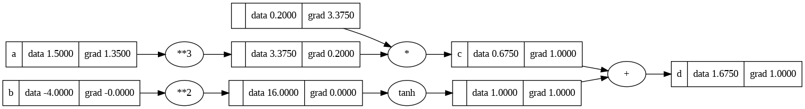

# minigrad


A minimal implementation of reverse-mode automatic differentiation (a.k.a. autograd / backpropagation) in pure Python.

Inspired by Andrej Karpathy's [micrograd](https://github.com/karpathy/micrograd),and [minigrad](https://github.com/kennysong/minigrad)

## Overview

Create a `Value` object.

```python
a = Value(1.5)
```

Do some calculations.

```python
b = Value(-4.0)
c = a**3 / 5
d = c + (b**2).tanh()
```

Compute the gradients.

```python
d.backward()
```

Plot the computational graph.

```python
draw_graph(d)
```



## Repo Structure

1. [`learnings/minigrad.ipynb`](minigrad.ipynb): notebook of me exploring miningrad.
1. [`minigrad/engine.py`](minigrad/engine.py): This has the value object and the operations available on it.
1. [`minigrad/nn.py`](minigrad/nn.py): The logic for layers and MLP.
1. [`minigrad/visualize.py`](minigrad/visualize.py): This just draws nice-looking computational graphs.

## Implementation

MiniGrad is a simple autograd implementation, using no external modules. 

The entirety of the auto-differentiation logic lives in the `Value` class in [`engine.py`](minigrad/engine.py). 

A `Value` wraps a float/int and overrides its [arithmetic magic methods](https://docs.python.org/3/reference/datamodel.html#emulating-numeric-types) in order to:
1. Stitch together a define-by-run computational graph when doing arithmetic operations on a `Value`
1. Hard code the derivative functions of arithmetic operations
1. Keep track of `∂self/∂parent` between adjacent nodes
1. Compute `∂output/∂self` with the chain rule on demand (when `.backward()` is called)


## Not in Scope

This project is just for fun and personal learning, so for anything other than basic implementation refer original source:

* [micrograd](https://github.com/karpathy/micrograd)
